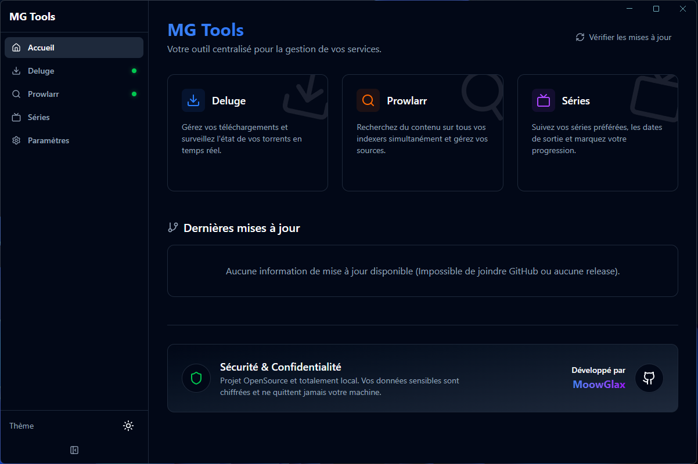
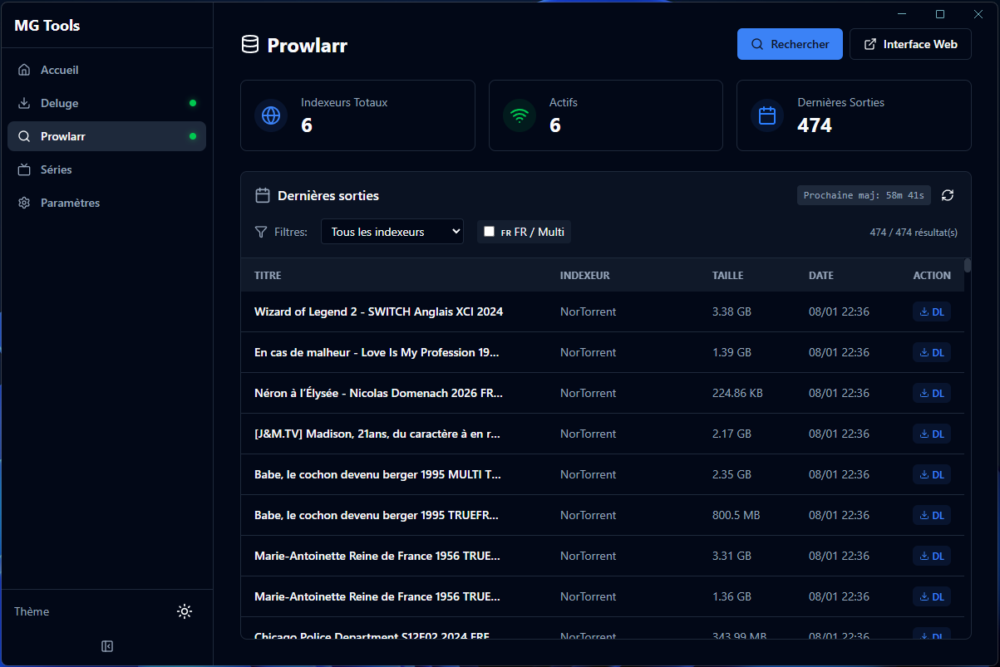
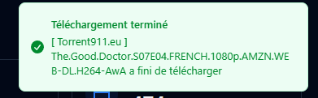

# MG-TOOLS

**Suite d'outils tout-en-un pour la gestion de médias, moderne, sécurisée et locale.**

MG-TOOLS est une application de bureau conçue pour centraliser et simplifier la gestion de vos séries et indexeurs (Prowlarr) avec une interface fluide et réactive. Le projet met un point d'honneur sur la **confidentialité** et la **sécurité** : toutes les données sensibles sont chiffrées et stockées localement sur votre machine.

## 📸 Aperçu

| Accueil | Séries & Prowlarr |
|:---:|:---:|
|  |  |
| **Interface Moderne** | **Recherche Centralisée** |

| Notifications | Sidebar |
|:---:|:---:|
|  |  |

## ✨ Fonctionnalités

### 📺 Gestion de Séries (TMDB)
- **Suivi centralisé** : Ajoutez vos séries favorites et suivez leur progression.
- **Mises à jour en temps réel** : Détection automatique des changements de statut (En cours, Terminée, Annulée).
- **Notifications** : Soyez alerté dès qu'une série change de statut ou qu'un nouvel épisode est annoncé.
- **Informations détaillées** : Synopsis, casting, notes, dates de diffusion.

### 🔍 Intégration Prowlarr
- **Recherche unifiée** : Recherchez du contenu sur tous vos indexeurs configurés via une interface unique.
- **Gestion simplifiée** : Visualisez l'état de vos indexeurs directement depuis l'application.

### 🛡️ Sécurité & Confidentialité
- **100% Local** : Aucune donnée n'est envoyée sur le cloud. Votre bibliothèque reste chez vous.
- **Chiffrement fort** : Les clés API (TMDB, Prowlarr) sont chiffrées via l'API SafeStorage d'Electron avant d'être stockées sur le disque.
- **Open Source** : Code transparent et vérifiable.

### 🚀 Autres Atouts
- **Mises à jour automatiques** : Système intégré via GitHub Releases.
- **Interface sombre/moderne** : Design soigné utilisant Tailwind CSS et Framer Motion.
- **Léger & Rapide** : Construit sur Electron + Vite + React.

## 🛠️ Installation & Développement

### Prérequis
- Node.js (v18+)
- NPM ou Yarn

### Installation

```bash
# Cloner le dépôt
git clone https://github.com/MoowGlax/MG-TOOLS.git

# Installer les dépendances
cd MG-TOOLS
npm install

# Lancer en mode développement
npm run dev
```

### Construction (Build)

```bash
# Créer l'exécutable pour Windows
npm run build:win
```

## 📝 Crédits

Développé par [MoowGlax](https://github.com/MoowGlax).

Licence MIT.
